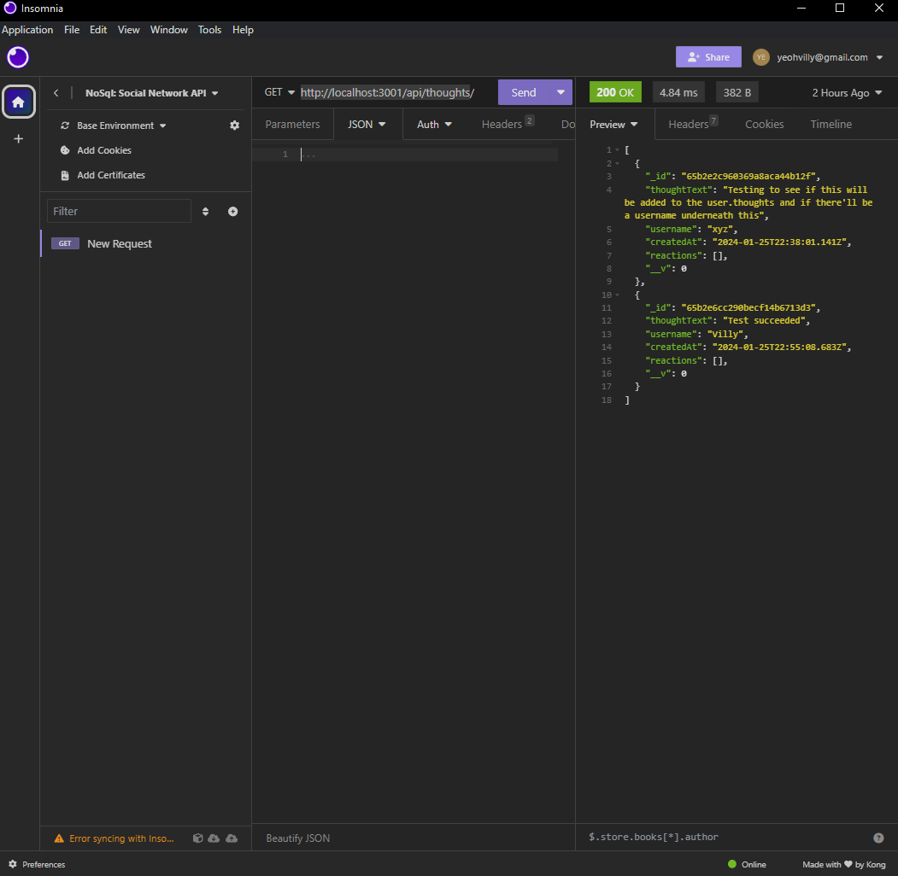
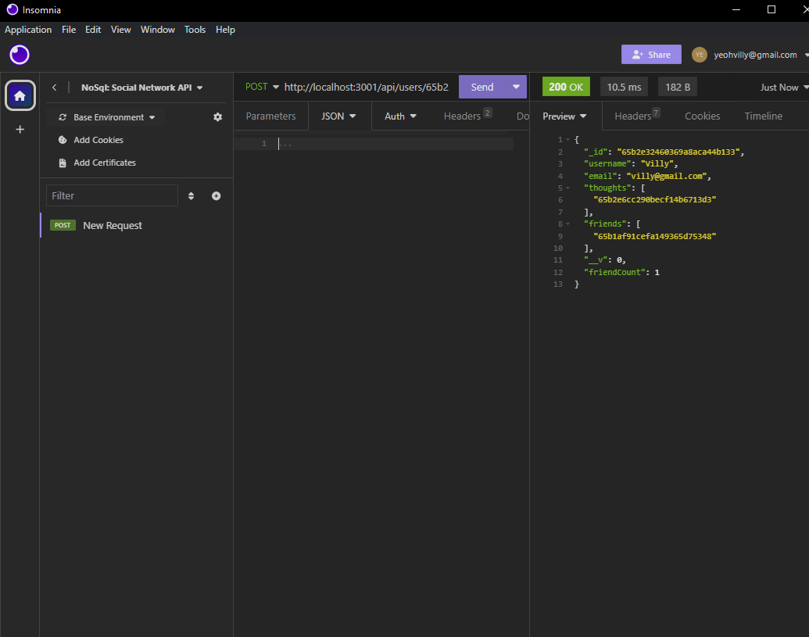

# Social Network API

## About
This is Module 18 challenge by Ohio State University bootcamp. This project contains codes that let the users interact with data to and fro the mongoose database. It is an API that is designed to help run a simple Social Network app.

## Description 
This API contains models for the users and their posts and comments, and users who have an account can create, update, or delete their posts and comments, which will be stored in the Mongo Database. This application will ensure that the website runs smoothly and as intended.

## Images of the application in Insomnia

## Link to Video
https://watch.screencastify.com/v/4beYiGCB0idyImR4gqnQ
